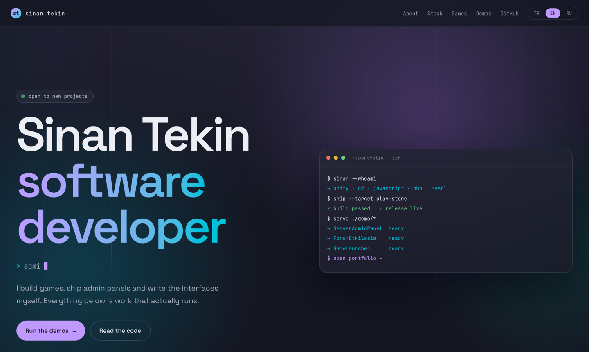

# sinan73k1n.space

My personal portfolio: one long landing page in three languages, an admin panel that edits every word of
it without touching code, and five hand-written demos that actually run in the browser.

**Live:** <https://sinan73k1n.space>

Built with ASP.NET Core MVC (`net10.0`), EF Core and SQL Server. Design, code and deployment are all mine.



---

## What is interesting here

- **The demos are not screenshots.** Five self-contained applications, each a single HTML file with zero
  external requests, embedded in the page and running inside a sandboxed iframe. They are the point of the
  site, not decoration.
- **Content is data, not markup.** Every heading, paragraph, game, technology chip, repo card and demo lives
  in the database and is edited from `/admin`. The Razor views contain no copy.
- **It runs with no database.** `IContentStore` has two implementations — a JSON file for development and
  SQL Server for production — so `dotnet run` works on a clean checkout with nothing installed.
- **Three languages with a real fallback.** TR / EN / RU, and any missing string falls back to Turkish
  rather than rendering empty.
- **Motion is optional.** Parallax, marquee, reveal animations and the demos' own animations all stop under
  `prefers-reduced-motion: reduce`.

---

## The demos

Each one lives in [`demos/`](demos/) as a single file, is pasted into the admin panel, and is served inside
`<iframe sandbox="allow-scripts">` — **never** with `allow-same-origin`, because the frame executes HTML and
JavaScript that came from the content store.

That sandbox drives every constraint they share: no external fonts or CDNs, no images, no `localStorage` or
cookies (storage access throws without a same-origin document), all state in memory, and a `window.__onizleme()`
hook the page calls when a demo is embedded as a small live preview so it skips its own sign-in screen.

| Demo | What it demonstrates |
|---|---|
| **Server Admin Panel** | Terminal-styled dashboard: services, containers, security jails, log stream, metrics |
| **Nutrition Tracker** | Two calculators — a Mifflin-St Jeor daily budget with every step of the arithmetic written out, and a meal calculator that resolves products and dishes through one formula |
| **Community Hub** | Forum feed with voting, a live chat with simulated traffic, a promo-code board with expiry countdowns and an auto-pull rule, plus a moderation queue |
| **Reward Wheel** | Probability made visible: slice width *is* the chance, the outcome is decided before the wheel turns, the prize table is editable and thousands of spins can be simulated and checked against it |
| **Game Launcher** | A download queue as a real state machine (`queued → downloading → verifying → installing → ready`) with a shared bandwidth cap and a concurrency limit you can change while it runs |

Everything in them is fictional sample data. Nothing connects to a real service.

---

## Architecture

N-tier, dependencies point one way only:

```
Portfolio.Entities        content model, DbContext, migrations, seed
        ↑
Portfolio.Repositories    IContentStore · JsonContentStore · SqlContentStore · media storage
        ↑
Portfolio.Services        content, admin, auth, TOTP, DTOs
        ↑
Portfolio.SITE_UI         controllers, Razor views, Admin area, wwwroot
```

A controller may not touch a repository or the `DbContext`, and never returns an entity — DTOs only.

### Content storage

`IContentStore` is the seam. `JsonContentStore` writes a JSON file (atomic write, keeps a `.bak`) and is the
default in development; `SqlContentStore` maps the same object graph onto relational tables in production. The
first run of an empty store fills it from `SeedIcerik`, which is code rather than a data file so the compiler
checks it and there is no "seed file missing" failure mode at startup.

### Admin

Public route `/admin`, password verified as a PBKDF2 hash, second factor as RFC 6238 TOTP. Secrets are read
from environment variables only (`Auth__Username`, `Auth__PasswordHash`, `Auth__TotpSecret`, and the connection
string) — they never appear in `appsettings.json` and never in this repository. With those variables unset the
app logs a warning and leaves the admin area open, which is intended for local development and nothing else.

---

## Getting started

```bash
git clone https://github.com/sinan73k1n/sinan73k1n.space.git
cd sinan73k1n.space
dotnet run --project src/Portfolio.SITE_UI
```

That is the whole setup. No database, no configuration: the JSON content store creates itself from the seed
on first run and `/admin` is reachable without credentials locally.

```bash
dotnet test        # 134 tests
dotnet build
```

The tests cover the auth and TOTP paths, content store round-trips, SQL ↔ object mapping, language fallback,
the metrics parser and image handling.

### Working on a demo

Demos are edited in `demos/*.html`, then pasted into the admin panel — editing the file does not update the
running site. Open one directly in a browser to work on it; the sign-in screen is skipped only when the page
embeds it as a preview.

---

## Layout

```
src/Portfolio.Entities/       content model, EF Core context, migrations, SeedIcerik
src/Portfolio.Repositories/   IContentStore + JSON and SQL implementations, media store
src/Portfolio.Services/       content and admin services, auth, TOTP, DTOs
src/Portfolio.SITE_UI/        MVC app, Admin area, CSS and JS
tests/Portfolio.Tests/        xUnit suite
demos/                        the five single-file demos
tools/                        icon generation, screenshots, deploy and backup scripts
design_handoff_portfolio/     the hi-fi design reference the site was built against
```

## Deployment

`tools/deploy.sh` publishes a Release build, scans the output for secrets, refuses to continue if it finds
any, and syncs the result to the server over rsync — deliberately without `--delete`, because uploaded media
lives next to the deployment rather than inside it. The target host is supplied as an environment variable and
is not stored in this repository.

## Design notes

The visual language came from a hi-fi prototype kept in `design_handoff_portfolio/`: no square grid, low-contrast
background motion, a single-direction violet-and-cyan palette, and demos that genuinely work. Icons are generated
from one source file (`wwwroot/icon.svg`) by `tools/ikon-uret.js` rather than maintained by hand.

## Notes on reuse

The code is public so it can be read. The content, copy, design and imagery are mine and are not offered for
reuse; if something in the implementation is useful to you, take the idea.

---

Comments in the source are in Turkish — they explain the decisions to me, and I have kept them honest, including
the ones that record what was tried first and why it failed.
